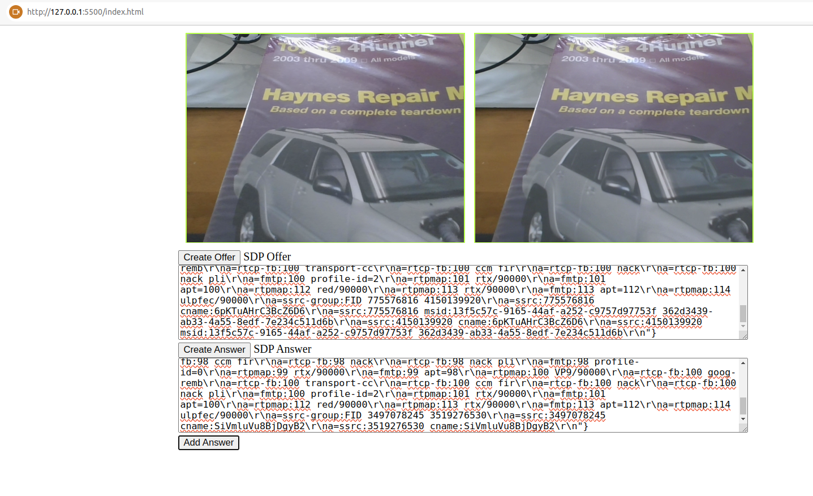
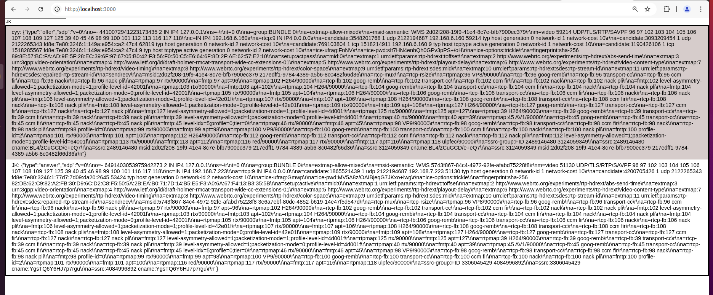
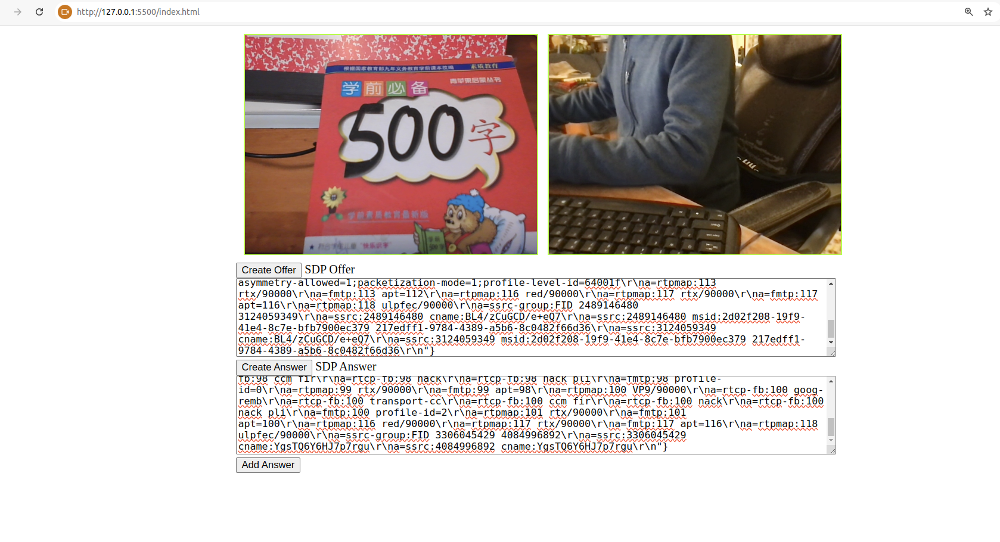

# WebRTC Peer to Peer

##
	Open index.html from Live Server
	Create Offer on the same Window
	Copy the Offer and paste to the Offer of the 2nd Window
	Create Answer on the 2nd Window
	Copy the Answer from the 2nd Windows to the 1st Window
	Click on Add Answer on the first Window.

## screenshots

